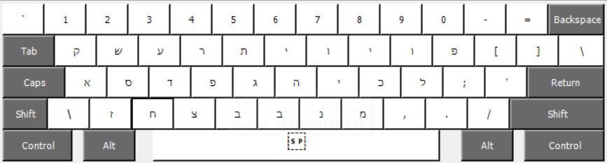
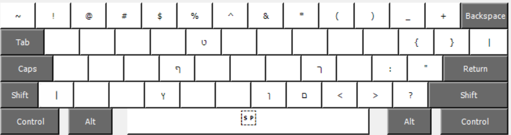

# hebrew-simple-qwerty-windows

* This is a simplified Hebrew keyboard layout for Microsoft Windows, in terms of keyboard layout based on the American (US) keyboard layout.
* In terms of language, the keyboard is designed for writing Modern Hebrew.
* The goal is to make it easy read and write Hebrew for a beginner who is used to QWERTY.
* Created with [Microsoft Keyboard Layout Creator](https://www.microsoft.com/en-us/download/details.aspx?id=102134)

# Setup

* Requirements: Microsoft Windows (tested on Windows 11)

1. Download the repository

```bash
git clone git@github.com:MattiasLevlin/hebrew-simple-qwerty.git
```

2. Run `setup.exe` to install the keyboard layout

```bash
setup.exe
```

# Layout

## Standard



## Shift



## First row

| Character | IPA | EN | Button  | Notes                                                     |
|-----------|-----|----|---------|-----------------------------------------------------------|
| ק         | [k] | k  | q       | Similarity in pronounciation, historically pronounced [q] |
| ש         | [ʃ] | sh | w       | Similarity in appearance between ש and w                  |
| ע         | [ʔ] | '  | e       | No direct equivalent, acts as vowel modifier              |
| ר	        | [ʁ] | r  | r       | Similarity in pronounciation, historically pronounced [r] |
| ת         | [t] | t  | t       | Same pronounciation as English t                          |
| י         | [i] | y  | y       | Similarity in pronounciation                              |
| ו         | [u] | u  | u       | Similarity in pronounciation                              |
| י         | [i] | i  | i       | Similarity in pronounciation                              |
| ו         | [o] | o  | o       | Similarity in pronounciation                              |
| פ         | [p] | p  | p       | Same pronounciation as English p                          |

## Second row

| Character | IPA        | EN       | Button  | Notes                                                     |
|-----------|------------|----------|---------|-----------------------------------------------------------|
| א         | [ʔ]        | '        | a       | Often indicates an a sound, can be placeholder for vowels |
| ס         | [s]        | s        | s       | Same pronounciation as English s                          |
| ד         | [d]        | d        | d       | Same pronounciation as English d                          |
| פ         | [f]        | f        | f       | Same pronounciation as English f                          |
| ג         | [g]        | g        | g       | Same pronounciation as English g (hard g)                 |
| ה         | [h]        | h        | h       | Same pronounciation as English h                          |
| י         | [j]        | y        | j       | Similarity in pronounciation                              |
| כ         | [k] or [χ] | k or ch  | k       | When inital often [k], same as English k, otherwise [χ]   |
| ל         | [l]        | l        | l       | Same pronounciation as English l                          |

## Third row

| Character | IPA  | EN | Button  | Notes                                                            |
|-----------|------|----|---------|------------------------------------------------------------------|
| ז         | [z]  | z  | z       | Same pronounciation as English z                                 |
| ח         | [χ]  | ch | x       | Similarity between key `x` and IPA pronounciation symbol ([χ])   |
| צ         | [ts] | ts | c       | [ts] commonly represented by `c` in other languages (DE, HU, ZH) |
| ב         | [v]  | v  | v       | Same pronounciation as English v                                 |
| ב         | [b]  | b  | b       | Same pronounciation as English b                                 |
| נ         | [n]  | n  | n       | Same pronounciation as English n                                 |
| מ         | [m]  | m  | m       | Same pronounciation as English m                                 |

## Shift / caps lock

These characters are accessible with shift or caps lock.

| Character | IPA  | EN  | Button    | Notes                         |
|-----------|------|-----|-----------|-------------------------------|
| ט         | [t]  | t   | shift + t | Same pronounciation as ת, [t] |
| ף         | [f]  | f   | shift + f | Ending variant of פ           |
| ך         | [χ]  | ch  | shift + k | Ending variant of כ           |
| ץ         | [ts] | ts  | shift + c | Ending variant of צ           |
| ן         | [n]  | n   | shift + n | Ending variant of נ           |
| ם         | [m]  | m   | shift + m | Ending variant of מ           |

# Principles

1. No dead keys, allowing for multiple instances of the same letter
2. No diacritics, as they are not typically used in casual Hebrew writing
3. Excluding diacritics, each unique sound in Modern Hebrew must be accessible with one key press
4. For direct or near equivalents between English/Hebrew, each key is connected to the Hebrew letter most similar in sound

Special cases are mentioned in the `Notes` in the tables above

# Diacritics

Diacritics in more formal Hebrew written contexts indicate vowel qualities and consonant distinctions. However, they are not typically used in casual Hebrew writing, and are therefore not included in this layout.

This means that the following sounds, differentiated if diacritics are included, are in this layout written with the same Hebrew letter:

## b and v

| IPA | EN | With diacritic  | Key                | In this layout |
|-----|----|-----------------|--------------------|----------------|
| [b] | b  | בּ               | b                  | ב              |   
| [v] | v  | ב               | v                  | ב              |   

## p and f

| IPA | EN | With diacritic  | Key                | In this layout |
|-----|----|-----------------|--------------------|----------------|
| [p] | p  | פּ               | p                  | פ              |
| [f] | f  | פ               | f                  | פ              |

## k and χ

* The key `k` is used for the letter כ
* כ is quite often pronounced [k] when it is the first letter in a word, and [χ] when it is not
* The sound [χ] (ch) can be written both using the letter כ and the letter ח.

| IPA | EN | With diacritic  | Key                | In this layout |
|-----|----|-----------------|--------------------|----------------|
| [k] | k  | כּ               | k                  | כ              |
| [χ] | ch | כ               | k                  | כ              |
| [χ] | ch | ח               | x                  | ח              |
